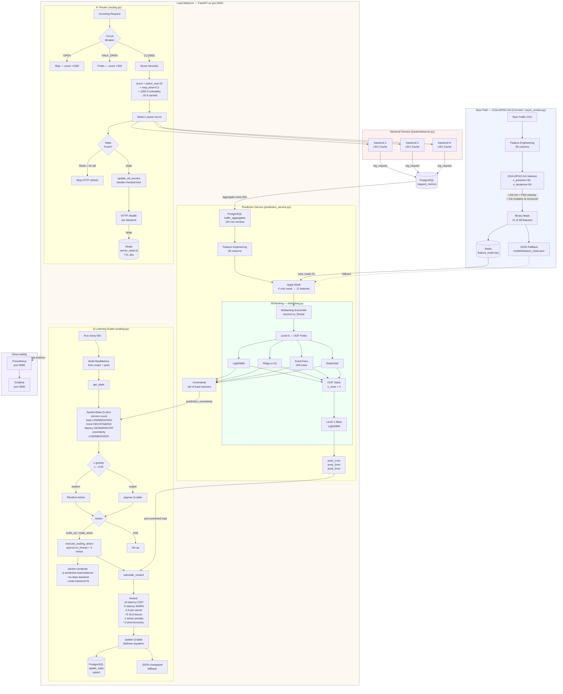
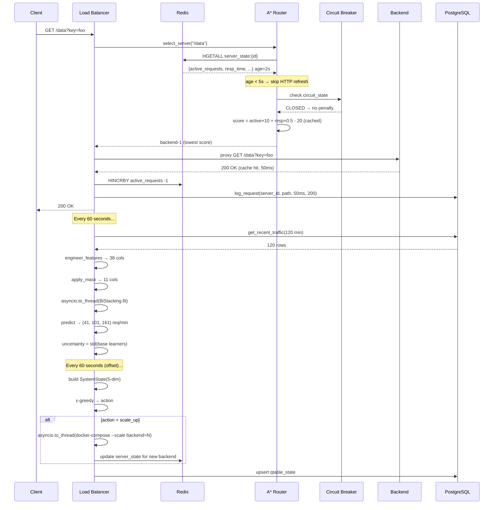
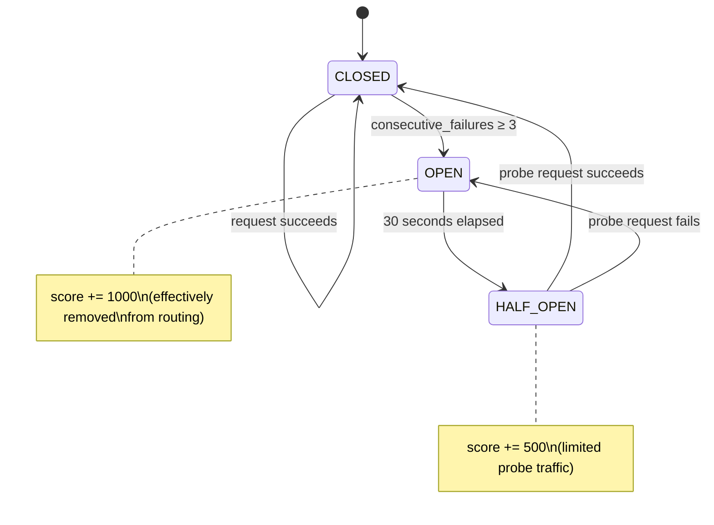
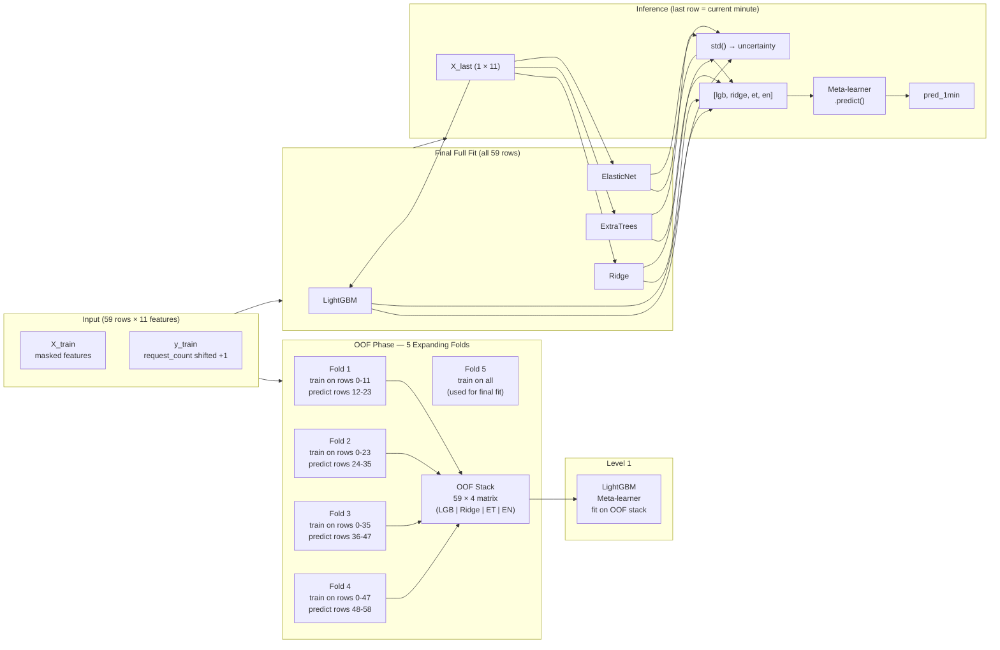
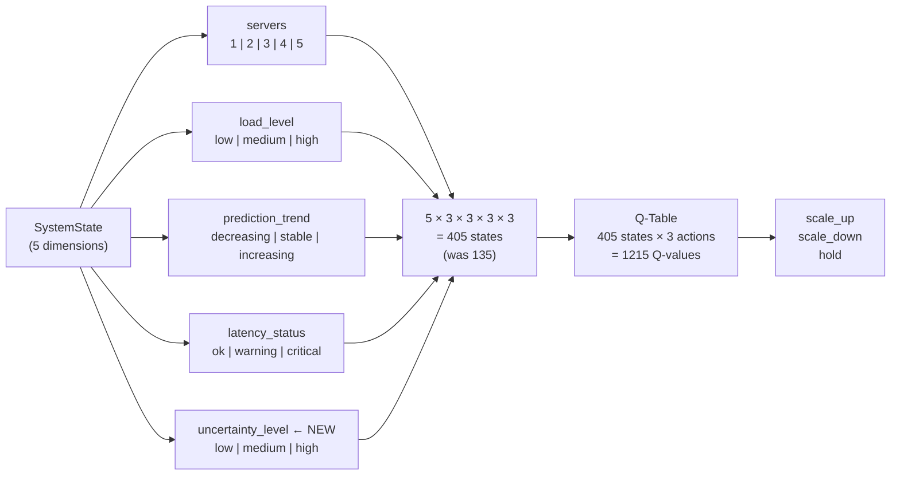

# Architecture & UML Diagrams

## Full System Pipeline

---

## Request Lifecycle Sequence

---

## Circuit Breaker State Machine

---

## BiStacking Training Flow

---

## Q-Learning State Space

